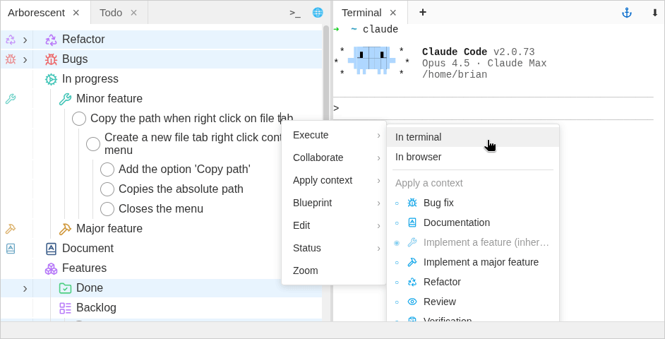

# Arborescent

**An outliner for project decomposition and AI workflows**

## What it does

Decompose complex projects into solvable tasks.  
Build with AI using reusable contexts.
Share your workflows with your community or team.  

## Why Arborescent?

Building with AI without oversight means losing control over your vision and architecture, ending up with something that doesn't scale.  
Arborescent lets you define and share your context and workflows, giving you full creative control while cutting out the repetition.  
As teams and communities encode their expertise into shared blueprints, AI interactions get better for everyone. Beginners stay relevant by benefiting from senior experience.  
Over time, human knowledge and AI capability compound — each making the other more effective.  

Arborescent is free and open source under GPL.

Here is Arborescent being used to build itself:



## Key features

- **Tree-based decomposition** — Fully featured outliner with keyboard navigation and drag and drop.
- **AI integration** — Build your prompt and send it to the integrated terminal or browser.
- **Reusable contexts** — Define contexts once, apply them to any branch. Changes are inherited automatically.
- **Knowledge as infrastructure** — Encode your context and workflows as blueprints, share with your team or community.

## Quick start

1. [Download the latest release](https://github.com/hercemer42/Arborescent/releases)
2. Break down your task
3. Open your preferred AI in the terminal or browser
4. Right-click to send your prompt

This is an early release — if you find bugs or have feedback, please [open an issue](https://github.com/hercemer42/Arborescent/issues).
If you run into any blockers, restart the application with Ctrl + R without losing your work.

## Example blueprints

- [React + Electron Development](blueprints/react-electron-blueprint.arbo) — Dev workflow with conventions and contexts for features/bugs/refactoring.
- [NestJS + React Development](blueprints/nestjs-react-blueprint.arbo) — Dev workflow with backend and frontend conventions.
- [Research Project](blueprints/research-project-blueprint.arbo) — Research workflow with sources, findings, analysis, and review contexts.
- [Team Offsite](blueprints/team-offsite-blueprint.arbo) — Plan team offsites with sessions, logistics, and budget.

## Learn more

- [Documentation](docs/README.md)

---

## Development

### Tech stack

- **Electron** + **Vite** — Desktop framework and build tooling
- **React** + **TypeScript** — UI and type safety
- **Zustand** — State management
- **@dnd-kit** — Drag and drop
- **xterm.js** — Terminal emulation

### Setup

```bash
npm install
```

### Scripts

```bash
# Development
npm start

# Tests
npm test              # Watch mode
npm run test:run      # Single run

# Code quality
npm run lint
npm run type-check

# Build
npm run package       # Package the app
npm run make          # Create installers
```

## License

GPL-3.0-only
